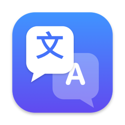
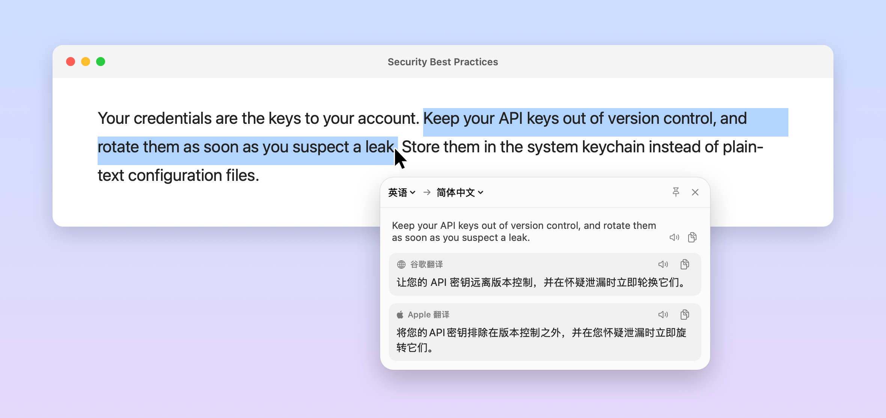
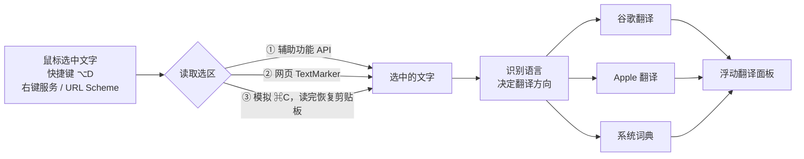

<p align="center">
  
</p>

<h1 align="center">SelectTranslate</h1>

<p align="center">
  <b>macOS 选中即翻译</b>：在任何 App 里选中英文，译文立刻出现在鼠标旁边。<br>
  <sub>Select-to-translate for macOS. Select English text anywhere and the translation pops up next to your cursor.</sub>
</p>

<p align="center">
  
  
  
  
  <a href="../LICENSE"></a>
</p>



<p align="center"><sub>同一句话：谷歌把 rotate（密钥）译成「轮换」，系统翻译直译成「旋转」。多个引擎并排显示，一眼就能对比。</sub></p>

## 功能亮点

- **选中即翻译**：用鼠标拖选、双击或三击选中英文，翻译面板直接出现在鼠标旁边。面板不抢键盘焦点，可以照常 `⌘C` 复制；继续打字、按 `Esc` 或点击别处时自动关闭。
- **不打扰**：默认只对英文生效，选中中文不会弹出。也可以改成「除简体中文以外的文字」「所有文字」，或者只显示一个翻译图标。
- **多引擎对照**：谷歌翻译（联网）和 Apple 翻译（离线）并排显示。英文单词还会附上「词典」App 里的释义（如牛津英汉汉英词典）：音标、义项、例句，能从 ran 找到 run，也能查 take off 这样的短语动词。
- **几乎所有 App 都能用**：原生 App 通过辅助功能接口读取选区，Chrome、VS Code、Codex 等 Chromium / Electron 应用则模拟一次 `⌘C` 读取，读完自动恢复剪贴板。
- **原生、轻量**：Swift 6 + SwiftUI 编写的菜单栏应用，Liquid Glass 风格面板，没有任何第三方依赖。
- **免费**：不需要任何 API Key。

## 系统要求

| 项目 | 要求 |
| --- | --- |
| 运行 | macOS 26 或更新版本 |
| 构建 | Xcode（含 macOS 26.4 或更新的 SDK）、Swift 6.2+ |
| 权限 | 辅助功能（读取其他 App 中选中的文字） |

## 安装

本项目只提供源码，请在本机构建。SelectTranslate 是 [MAC](../README.md) 仓库的子项目：

```bash
git clone https://github.com/SalomeAilin/MAC.git
cd MAC/SelectTranslate
./build.sh install
```

脚本会编译、打包、签名，安装到 `/Applications`（不可写时用 `~/Applications`）并启动。本机构建的 App 不会被 Gatekeeper 拦截。

首次启动后需要三步设置：

1. **开启辅助功能权限**：在弹出的提示中点「打开系统设置」，在「隐私与安全性 › 辅助功能」里打开 SelectTranslate。打开后立即生效，不用重启 App。
2. **下载离线语言包**：第一次翻译时点面板里的「下载语言包…」，或在「设置 › 翻译引擎」中下载。只用谷歌翻译的话可以跳过这一步。
3. **（可选）开机自动运行**：在「设置 › 通用」中打开「登录时自动启动」。

## 使用方法

### 触发翻译

| 方式 | 操作 | 说明 |
| --- | --- | --- |
| 选中即翻译 | 用鼠标拖选、双击或三击 | 默认只对英文生效 |
| 翻译选中文字 | `⌥D` | 对任何语言都有效；没有选中文字时打开输入框 |
| 输入翻译 | `⌥A` | 直接输入要翻译的内容 |
| 右键菜单 | 右键 › 服务 › 用 SelectTranslate 翻译 | 不需要辅助功能权限 |
| 菜单栏 | 点击菜单栏图标 | 翻译剪贴板、切换划词模式和目标语言 |
| URL Scheme | `open "selecttranslate://translate?text=hello"` | 可以接入快捷指令、Raycast、Alfred |

### 翻译面板

- 自动识别原文语言，**中英互译**：原文是中文时译成英文，其他语言译成中文。
- 原文可以直接修改，停顿后自动重新翻译；可以朗读原文和译文，一键复制。
- 点图钉固定窗口，点击别处不会关闭；拖动顶栏可以移动位置；按 `Esc` 关闭。

### 设置

| 设置 | 可选项 | 默认值 |
| --- | --- | --- |
| 选中文字后 | 直接翻译 / 显示翻译图标 / 不处理（只用快捷键） | 直接翻译 |
| 适用的文字 | 只有英文 / 除简体中文以外的文字 / 所有文字 | 只有英文 |
| 快捷键 | 任意组合，可以清除 | `⌥D`、`⌥A` |
| 翻译为 / 原文已是该语言时改译为 | 20 种语言 | 简体中文 / 英语 |
| 翻译引擎 | 谷歌翻译、Apple 翻译、系统词典、Claude | 前三个开启 |
| 登录时自动启动 | 开 / 关 | 关 |

「选中文字后」和「适用的文字」在菜单栏图标的菜单里也能直接切换。

## 翻译引擎

| 引擎 | 联网 | 费用 | 说明 |
| --- | --- | --- | --- |
| 谷歌翻译 | 是 | 免费 | 使用谷歌网页翻译的公开接口（非官方 API），需要能访问谷歌，以后可能失效 |
| Apple 翻译 | 否 | 免费 | macOS 内置的翻译模型，首次使用需要下载语言包。不支持 Apple 智能的 Mac 只能用基础引擎，译文偏直译 |
| 系统词典 | 否 | 免费 | 使用「词典」App 中启用的词典，只查英文单词和短语 |
| Claude | 是 | 按用量计费 | 可选，需要 Anthropic API Key，默认关闭；单词和短语会给出词典式解释 |

## 隐私

- **谷歌翻译**开启时，选中的文字会发送到谷歌服务器。在「设置 › 翻译引擎」中关闭后，所有翻译都在本机完成。
- **Claude** 只在你填入 API Key 并启用后才会使用，文字会发送给 Anthropic；API Key 保存在系统钥匙串里。
- **剪贴板兜底**：在 Chrome 等应用中模拟 `⌘C` 读取选区，读完恢复原来的剪贴板。剪贴板历史工具（如 Paste、Maccy）可能会记下这次复制。
- **诊断日志**只记录 App 名称和文字长度，不记录文字内容。
- 不收集任何统计数据。

## 工作原理



**读取选区：先用辅助功能，不行再用剪贴板**
- 先读焦点控件的 `kAXSelectedTextAttribute`；网页内容（Safari 等）读 `AXSelectedTextMarkerRange`，必要时向上查找网页区域元素。这条路不碰剪贴板。
- 读不到时（Chromium / Electron 应用），把 `⌘C` 定向发送给来源 App，读取后恢复剪贴板。期间如果用户有输入、切换了 App，或者剪贴板被其他程序改写，就放弃本次读取，也不覆盖当时的剪贴板。按快捷键触发时，会先等修饰键松开再发送 `⌘C`，避免变成 `⌥⌘C`。
- 辅助功能调用设置了 0.35 秒超时，目标 App 卡住时不会拖住翻译。

**判断"是不是在选字"**
- 只在拖动超过 5pt、双击、三击或 Shift 点击后才检查选区。
- 比较鼠标按下与松开时窗口的位置，拖动或缩放窗口不算选字。
- 新的选区、用户输入、切换 App 都会取消还没完成的读取；只有数字和符号的选区不翻译。

**面板：不打断当前工作**
- 用 `nonactivatingPanel` 实现：面板可以接收键盘输入，但原来的 App 始终在前台。
- 默认出现在鼠标右下方，下方空间不够时出现在上方；高度随内容变化，最多占屏幕的 80%。

**语言识别**
- 有假名判为日语，有谚文判为韩语，以汉字为主判为中文；简繁体按"转成简体后有多少字变化"区分。
- 其他语言交给 `NLLanguageRecognizer`；很短的纯 ASCII 文本（如 "OK"）没把握时按英语处理。

**词典**
- 系统公开的 `DCSCopyTextDefinition` 会把英文 `run` 匹配成拼音 `rùn`，所以改用 DictionaryServices 的私有接口按词条精确匹配。私有接口在运行时用 `dlsym` 加载，不存在时自动跳过词典，不影响翻译。
- 把词典的纯文本整理成词性、义项、例句分行显示，并去掉中文后附带的拼音。
- 查不到时做词形还原（`ran → run`、`mice → mouse`），短语动词从主词条中截取对应的小节。

**快捷键**：使用 Carbon 的 `RegisterEventHotKey`，不需要任何权限；被其他 App 占用时在设置中提示，录制新快捷键时暂停已注册的快捷键。

## 常见问题

<details>
<summary><b>选中文字后没有弹出翻译？</b></summary>

1. 确认已在「系统设置 › 隐私与安全性 › 辅助功能」中打开 SelectTranslate。
2. 默认只对英文生效：选中的是中文或其他语言时不会弹出，可以按 `⌥D`，或在菜单栏图标 ›「选中文字后」›「适用的文字」中调整。
3. 个别 App 不提供选区，也不支持复制，这时可以用 `⌥A` 输入，或用右键菜单里的「服务」。
4. 想知道卡在哪一步，可以查看诊断日志：

```bash
log show --last 10m --info --predicate 'subsystem == "com.alsay.SelectTranslate"'
```

</details>

<details>
<summary><b>重新编译安装后不工作了，但系统设置里的开关明明是开着的？</b></summary>

`build.sh` 默认使用 ad-hoc 签名，每次编译后签名都会变，系统设置里那个开关对新版本已经无效。运行下面的命令清掉旧授权并启动 App，再按提示重新打开开关：

```bash
tccutil reset Accessibility com.alsay.SelectTranslate; open /Applications/SelectTranslate.app
```

这条命令只在重新安装后需要；平时运行它会把当前授权清掉。

</details>

<details>
<summary><b>翻译不够准确？</b></summary>

Apple 翻译在不支持 Apple 智能的 Mac 上只能用基础引擎，「高质量」模式也不会有区别，译文偏直译。谷歌翻译通常更通顺，两个结果并排显示，可以对照着看。

</details>

<details>
<summary><b>谷歌翻译显示「连不上」？</b></summary>

谷歌翻译需要能访问谷歌。网络不通时，Apple 翻译和词典照常工作；也可以在「设置 › 翻译引擎」中关掉谷歌翻译。

</details>

<details>
<summary><b>右键菜单的「服务」里没有 SelectTranslate？</b></summary>

安装后系统需要刷新服务列表，可以注销后重新登录，或者运行：

```bash
/System/Library/CoreServices/pbs -update
```

</details>

<details>
<summary><b>词典释义是英文解释，不是中文？</b></summary>

词典按「词典」App 设置中的顺序查找。打开「词典」App › 设置，勾选「牛津英汉汉英词典」并拖到最前面。

</details>

## URL Scheme

| 地址 | 作用 |
| --- | --- |
| `selecttranslate://translate?text=…` | 翻译指定的文字 |
| `selecttranslate://selection` | 翻译当前选中的文字 |
| `selecttranslate://input` | 打开输入翻译 |
| `selecttranslate://settings?tab=general` | 打开设置（`general` / `engines` / `about`） |

## 卸载

1. 如果打开过「登录时自动启动」，先在「设置 › 通用」中关掉。
2. 退出 App（菜单栏图标 › 退出），删除 `/Applications/SelectTranslate.app`。
3. 在「系统设置 › 隐私与安全性 › 辅助功能」中选中 SelectTranslate，点「−」删除。
4. 删除设置数据：

```bash
defaults delete com.alsay.SelectTranslate
```

5. 如果保存过 Claude API Key，从钥匙串中删除：

```bash
security delete-generic-password -s com.alsay.SelectTranslate
```

## 开发

### 构建脚本

| 命令 | 作用 |
| --- | --- |
| `./build.sh` | 编译并打包到 `dist/SelectTranslate.app` |
| `./build.sh install` | 打包后安装到 `/Applications` 并启动 |
| `./build.sh run` | 打包后直接从 `dist/` 启动 |
| `CONFIG=debug ./build.sh run` | 构建并启动调试版 |

脚本通过 `xcrun` 使用当前选中的 Xcode 工具链（遵循 `DEVELOPER_DIR` 和 `TOOLCHAINS`），不会修改全局配置；目标 App 还在运行时会停止，提示先退出。可选环境变量：

| 变量 | 作用 |
| --- | --- |
| `SIGN_IDENTITY` | 用钥匙串里的代码签名证书签名（默认 ad-hoc 签名） |
| `SELECTTRANSLATE_SCRATCH_PATH` | SwiftPM 构建目录（默认 `.build`） |
| `SELECTTRANSLATE_OUTPUT_DIR` | App 输出目录（默认 `dist`） |

### 项目结构

```
SelectTranslate/
├── Package.swift                         Swift 6.2，默认 MainActor 隔离
├── build.sh                              编译、打包、签名、安装
├── Resources/                            Info.plist、App 图标
├── scripts/make_icon.swift               生成 App 图标
└── Sources/SelectTranslate/
    ├── main.swift、AppDelegate.swift     启动，串联各种触发方式
    ├── System/
    │   ├── SelectionMonitor.swift        全局鼠标监听，判断是否在选字
    │   ├── SelectionReader.swift         读取选区：辅助功能 API + 剪贴板兜底
    │   ├── Hotkey.swift                  全局快捷键
    │   └── ServiceProvider.swift         右键「服务」菜单
    ├── Engines/
    │   ├── GoogleTranslator.swift        谷歌翻译
    │   ├── AppleTranslator.swift         Apple 翻译（Translation 框架）
    │   ├── SystemDictionary.swift        系统词典查询与排版
    │   ├── ClaudeTranslator.swift        Claude（可选，SSE 流式）
    │   └── TranslationFailure.swift      错误类型
    ├── UI/
    │   ├── TranslationPanel.swift        浮动面板的窗口和定位
    │   ├── TranslationView.swift         面板内容（SwiftUI）
    │   ├── TranslationViewModel.swift    语言判断、并行调度各引擎
    │   ├── SelectionIcon.swift           划词图标
    │   ├── StatusItemController.swift    菜单栏
    │   ├── LanguagePackDownloader.swift  离线语言包下载
    │   └── Settings/                     设置窗口
    └── Support/                          设置存储、语言识别、钥匙串、权限、朗读、日志
```

## 许可证

本项目随 MAC 仓库使用 [MIT 许可证](../LICENSE)。

本项目与 Apple、Google、Anthropic 没有任何关联。谷歌翻译使用的是网页翻译的公开接口，并非官方 API，请遵守相关服务条款；词典释义的内容归各词典的出版方所有。
